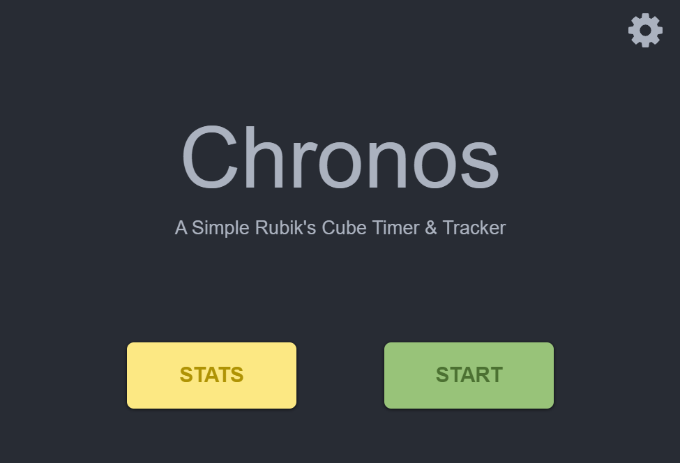
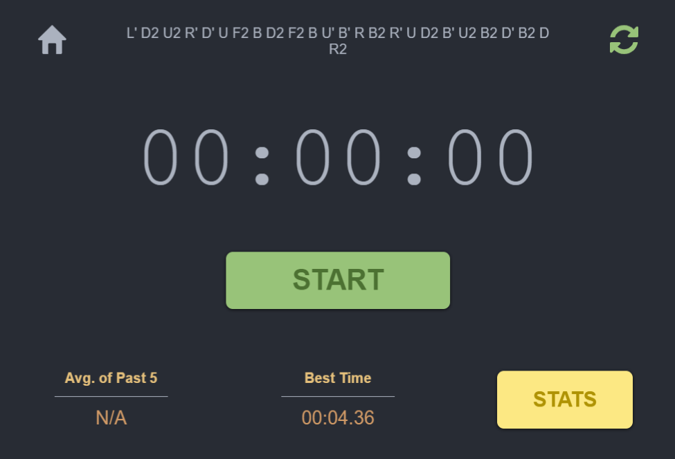
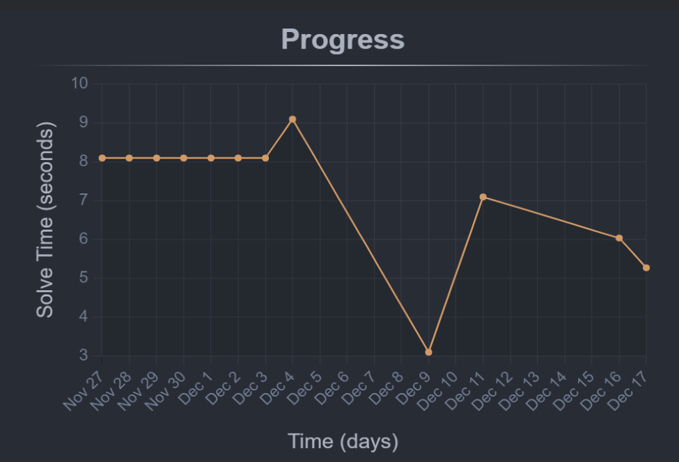
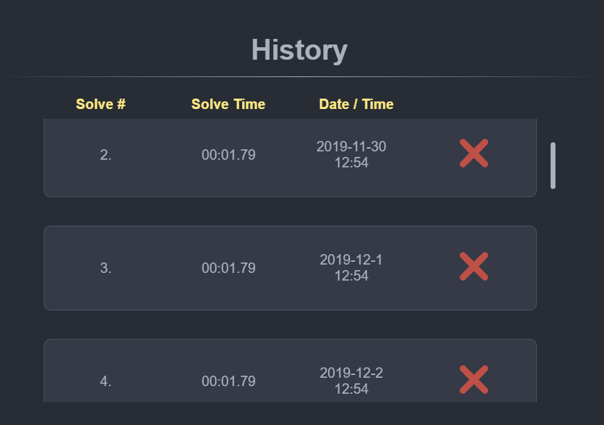
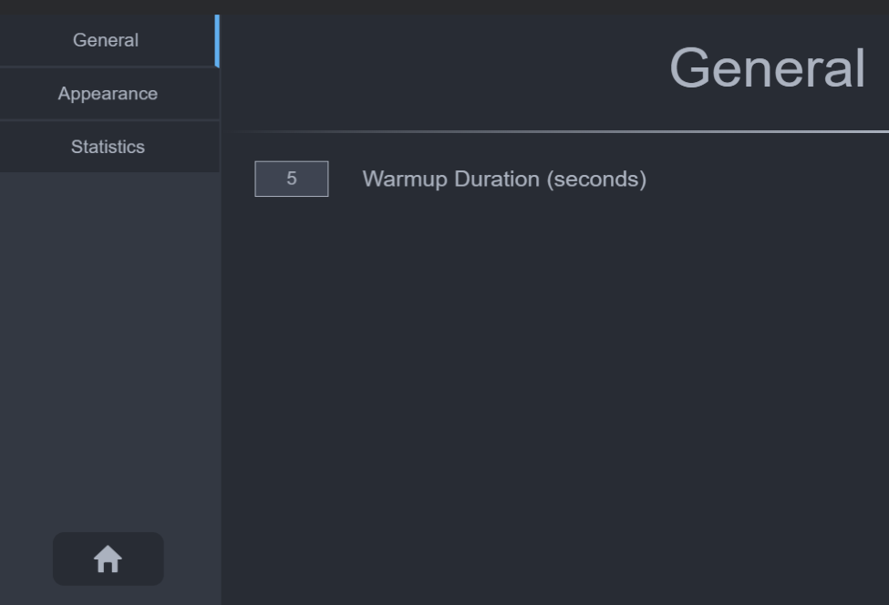

# Chronos

Chronos is a simple rubik's cube timer & stat tracking application. 

## Features
* A stopwatch based timer that can be controlled on-screen or via the keyboard.
* Warmup countdown timer to simulate the time allocated for inspecting the cube before a solve.
* Cube scramble generator that generates scrambles according to WCA notation.
* Dedicated stats page showcasing your average solve times over different timeframes as well as a chart displaying your progress over the past month.

   

   

   

 

## Installation

### Pre-built Application Binaries
The application was built using the Electron framework and so it can be downloaded and installed on Mac, Windows & Linux.

You can find the application binaries for each platform over [here](https://github.com/nrednav/chronos/releases).

> Note:- The binaries available through the link above are not signed and so they may be flagged by your system. If you'd like to build the binaries yourself instead of downloading them, please follow the instructions below for building from source.

### Building from source
To build this application from source, first make sure you have [Node.js](https://nodejs.org/en/) and [Git](https://git-scm.com/) installed on your machine.

Then, using a CLI, clone the repository via:

`git clone https://github.com/nrednav/chronos.git`

Navigate into the cloned directory using: 

`cd chronos`

Install the required packages with:

`npm install`

Once the packages have been installed, you may use the scripts provided in package.json to package the application for your platform of choice.

To package the application for your current platform, run this in the root of the project directory:

`npm run electron:build`

For developers, you may run the app in development mode using: 

`npm run electron:serve`

## Usage

### Main
At the core of this application is a stopwatch timer, that can be triggered using the on-screen start/stop buttons or via the spacebar key on your keyboard.

Upon stopping the main timer, you will be prompted to either save or discard the current solve time. Clicking save will add the current solve time to your stats history whereas discard will ignore it.

### Stats
At the bottom of the stats page you will find a list of your past 15 solve times. If you recently saved a solve time and now want to remove it, you'll be able to do so here by clicking the red delete button on 

### Settings
Over on the settings page, you can set the duration of the warmup countdown timer, change the appearance of the application as well as avail of an option to reset all statistics.

## Attributions

Credit for the rubik's cube scramble generator code goes to Jonathan Robson [@jnrbsn](https://github.com/jnrbsn): 

* https://github.com/jnrbsn/rubiks-cube-scrambler

## Feature/Pull Requests

If you'd like to request any additional features for this application or make contributions yourself, please feel free to open a new issue or submit a pull request and I'll be sure to take a look at them.
